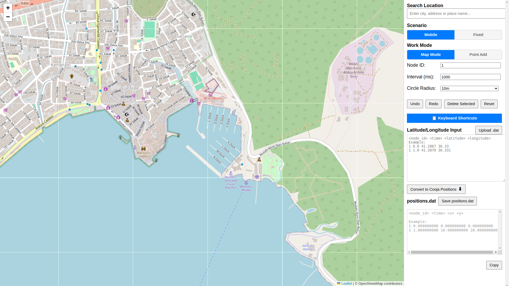
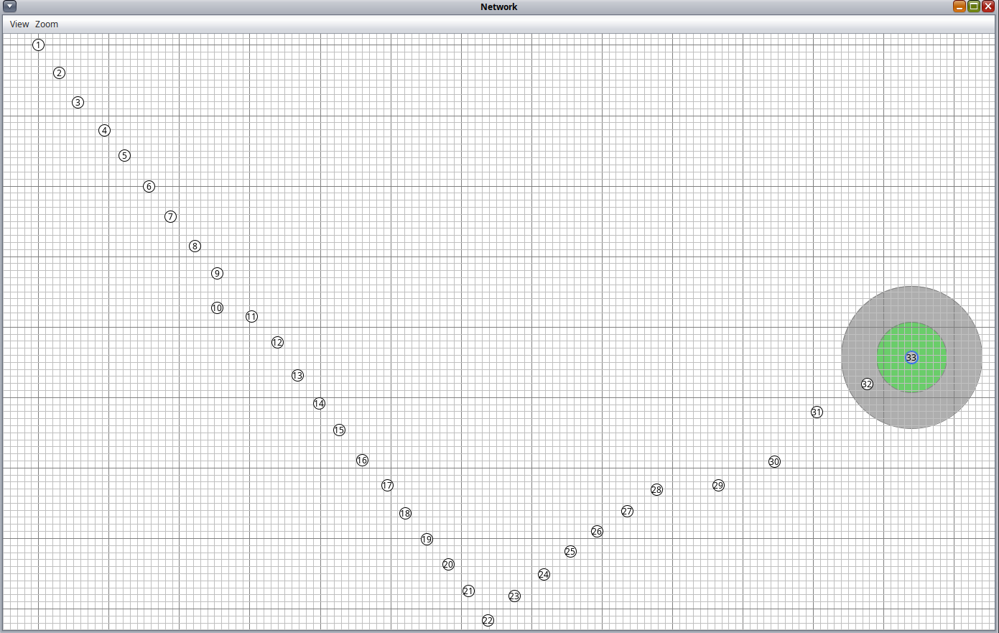

# Cooja Positioner

A web tool that converts geographic coordinates (latitude/longitude) into [Cooja](https://github.com/contiki-ng/cooja) simulator’s XY coordinate system and visualizes node positions on an interactive map. Place points on the map, then export a `positions.dat` file ready for use in Cooja.

---

## Features

- **Scenarios**
  - **Mobile** — One node over time: same node ID, increasing time (e.g. movement path).
  - **Fixed** — Multiple static nodes: unique node IDs, time always zero.

- **Map**
  - OpenStreetMap (Leaflet). Search by place name or address (Nominatim).
  - **Work modes:** Map Mode (pan/zoom) and Point Add (add/move points).

- **Points**
  - Add points by clicking; drag to move. Multi-select with Ctrl+Shift+Click; delete with Del. Undo/Redo.
  - Right-click a circle: **Rename Node-ID** or **Delete**.
  - Last clicked point is highlighted with a dashed circle.

- **I/O**
  - Paste lat/lng text and **Convert** to Cooja XY. Upload a `.dat` file to load positions on the map.
  - **positions.dat** output: `node_id time x y z` (relative meters; first point at 0,0; Y negated for Cooja).

- **Keyboard shortcuts** — Ctrl+? to open the shortcuts overlay (e.g. Ctrl+A, Del, Ctrl+Z/Y).

---

## Quick start

1. [Click](https://cooja-positioner-project.github.io/) for using online
2. You can also download this repository and open [index.html](https://github.com/cooja-positioner-project/cooja-positioner/blob/main/index.html) file in your browser localy (no server required).
3. Use **Search Location** to go to a region, then set **Work Mode** to **Point Add**.
4. Choose **Scenario**: **Mobile** (one node over time) or **Fixed** (multiple nodes, time 0).
5. Click on the map to add points. Use **Copy** or **Save positions.dat** to get the output for Cooja.

---

## Screenshots

### Main interface (Map + Sidebar)

  
*Map view with sidebar: Search, Scenario (Mobile/Fixed), Work Mode, and position list.*
*Mobile scenario: same node ID on all points, time column increases (0, 1, 2, …).*
*Fixed scenario: different node IDs per point, time always 0.*

### Sensor nodes deployed on a bridge

*Tool generates a `positions.dat` file (node_id, time, x, y, z).*

### Projection of the bridge nodes onto the Cooja coordinate system
  
*After loading `positions.dat` file in Cooja simulator.*

---

## Output format

The tool generates Cooja-style positions:

```
node_id time x y z
```

- Coordinates are **relative** in meters; the first point is the origin (0, 0).
- **Y** is negated to match Cooja’s coordinate system.
- **Mobile:** one `node_id`, `time` increases. **Fixed:** different `node_id` per line, `time` is 0.

---

## Keyboard shortcuts

| Action           | Shortcut           |
|------------------|--------------------|
| Select all       | Ctrl+A             |
| Multiple selection | Ctrl+Shift+Click  |
| Delete selected  | Del                |
| Undo             | Ctrl+Z             |
| Redo             | Ctrl+Y             |
| Show shortcuts   | Ctrl+?             |

---

## Please cite us

If you use Cooja Positioner in academic work or in a product, we would appreciate a citation.

**Plain text:**

```text
Cooja Positioner. A web tool for generating Cooja simulator position files from geographic coordinates. https://github.com/cooja-positioner-project/cooja-positioner
```

**BibTeX:**

```bibtex
@misc{cooja-positioner,
  title        = {Cooja Positioner: Geographic to Cooja position file converter},
  author       = {Name1,Name2,Name3 and Name4},
  year         = {2026},
  howpublished = {\url{https://github.com/cooja-positioner-project/cooja-positioner}},
  note         = {Web tool for generating positions.dat from map input}
}
```
